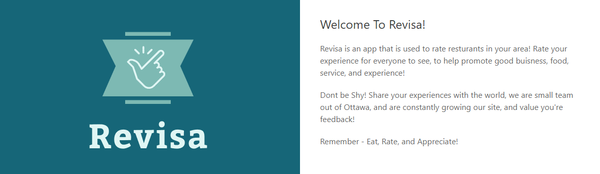
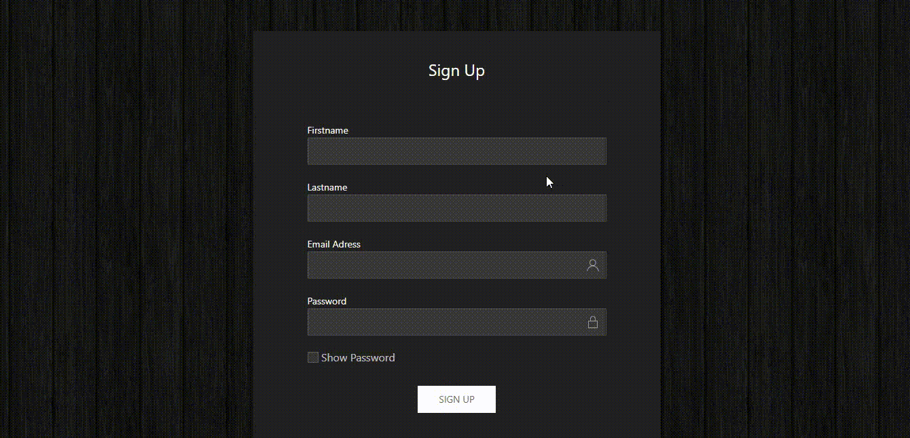
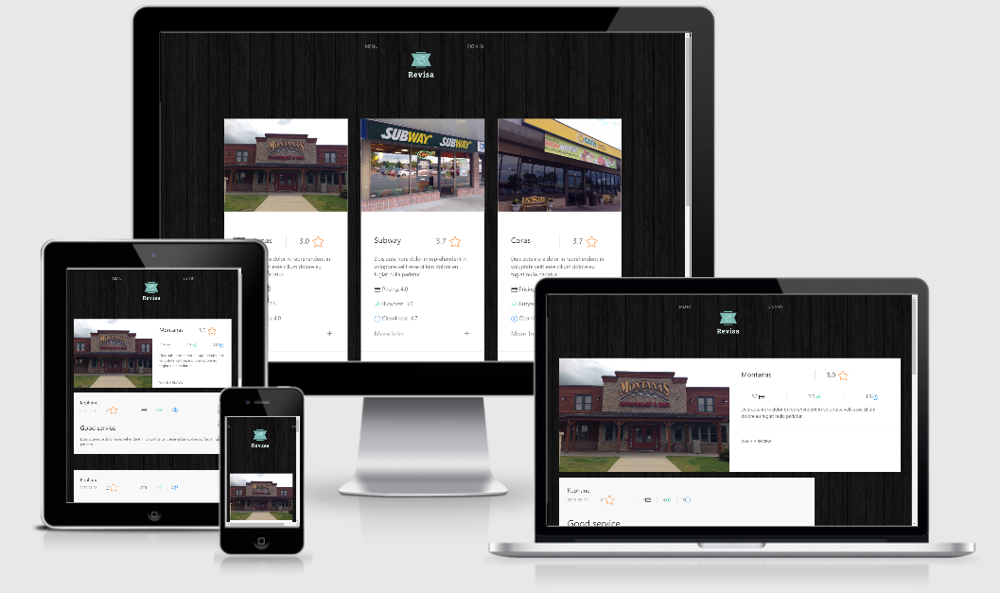

# Revisa      




- Link to Deploy app, at the end. [>> GO ⬇️ <<](#url)


- SIGNUP




- RESTAURANTS


- COMMENTS


- NEW RESTAURANT


## 📌Table of Content
* [Description](#description)
* [Installation](#installation)
* [Usage](#usage)
* [Test](#test)
* [Contributing](#contributing)
* [License](#license)
* [Details](#details)
* [Features](#features)
* [URL](#url)
* [Questions](#questions)

## 📋Description

A restaurant quality checker, with some review threads.
Especially during a post-pandemic time like today, Fear has taken the masses by storm. Uncertainty is rampant. So, to reassure the public and to give them more information, we are building a review app that contains recent relevant information and reviews on a restaurant, affordability, atmosphere/location, and if it is clean (COVID-19 PRECAUTION FRIENDLY), and also, if the food is succulent.

## User Case

```
As A random bystander who is looking for a restaurant
I WANT an application that can show me recent reviews of public restaurants
SO THAT I can make a smart decision about which business is optimal for my needs.
Criteria by which to judge an establishment:
Cleanliness
Affordability
Atmosphere
Food Quality

```

- Open the application using "command line", (recomended: GitBash).

## 💿Installation
    1. Install node.js  
    2. Clone the repository
    3. npm install

## ▶️Usage
Open the server app using ```node server``` in your terminal (root repo). 

## 📊Test
 ```
 npm run test (None).
 ```

## 🤝Contributing

Feel free to pull request and give me your suggestions if any.

## ⚖️License  

This project is under the MIT License.

## 📑Details
```
This repository contains these files: 
 Project 2 
      > Config 
        >Passport
          passport.js
        config.json
      > Controllers
         authcontrollers.js
      > db
       schema.sql
       seeds.sql
      > Models
       index.js
       restaurants.model.js
       review.model.js
       user.js
      > Public
        > Assets
         > css
           styles.css
         > js
          client.js
          reviews.js
      > routes
       api-restaurants.js
       api-reviews.routes.js
       auth.js
       handlebars.routes.js
      > views
       > Layouts
          main
       dsahbord.handlebars
       index.handlebars
       new.handlebars
       restaurants.handlebars
       reviews.handlebars
       signin.handlebars
       signup.handlebars
  .eslintc.json
  .travis.yml
  license.txt
  package.json
  readme.md
  server.js
NPM PACKETS 
 - express
 - epress-session
 - passport
 - body-parser
DB 
- mySql 
- sequelize
```

## 📀Features

- ability to login and be stored as a unique user. 
- view and add resturant listings in your area
- review and see other users reviews on restaurants
- take those reviews and average them out and store the data in our database 
- users passwords are hashed with bcrypt
- fully responsive.



## 🔗URL  
      

- Check the Demos Youtube "https://youtu.be/DWZUl9LlSak"
- The URL to this repo page is "https://github.com/diegolehyt/Project2.git"
- Deploy App on Heroku page Here! --> "https://revisaproject2.herokuapp.com/" <--
 

## 👤Questions  
### Members

- Kephane Loemba


✉️ E-mail: keph.16rock@gmail.com


- Kayce Churchill 


✉️ E-mail: kaceychurchill@gmail.com


- Diego Lehyt


✉️ E-mail: diegolehy00@gmail.com